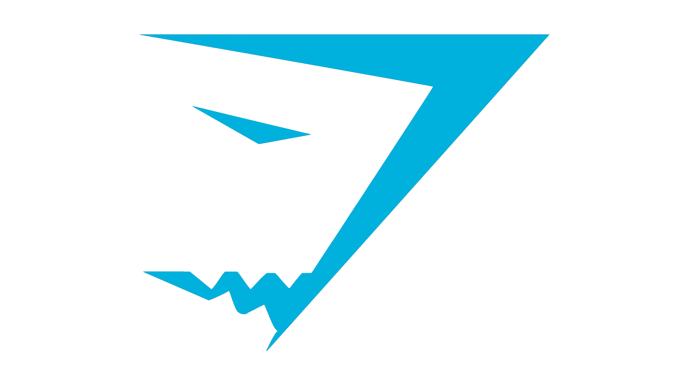
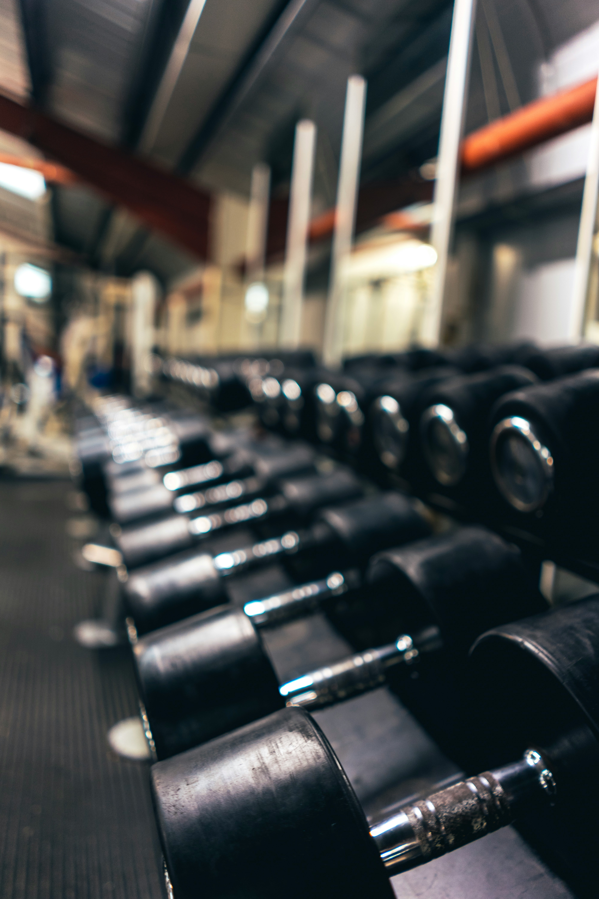
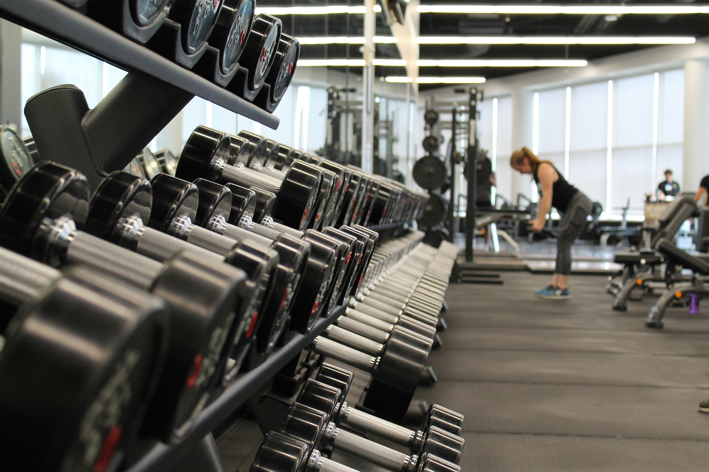
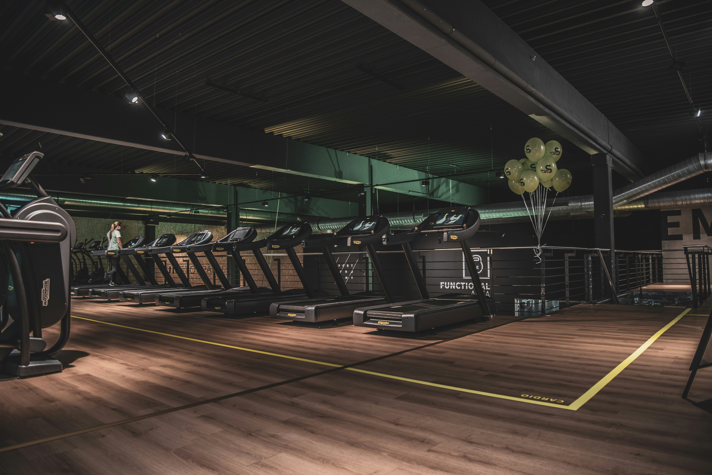

<div align="center">

# 🏋️ **GYMSHARK FITNESS** 💪

### *Unleash Your Strength – Premium Fitness Apparel & Equipment*

[](https://github.com/binusha12345/GYM_Shark)
[](https://github.com/binusha12345/GYM_Shark)
[](https://github.com/binusha12345/GYM_Shark)
[](https://github.com/binusha12345/GYM_Shark)
[](https://nodejs.org)
[](https://getbootstrap.com)

<br>



### 🔥 **DOMINATE YOUR WORKOUT. DEFINE YOUR STYLE.** 🔥

<br>
</div>

---

## 📋 **Table of Contents**

- [✨ Project Overview](#-project-overview)
- [🚀 Features](#-features)
- [🛠️ Tech Stack](#️-tech-stack)
- [📸 Screenshots](#-screenshots)
- [⚙️ Installation & Setup](#️-installation--setup)
- [📂 Project Structure](#-project-structure)
- [📄 Pages Overview](#-pages-overview)
- [🎯 Core Functionality](#-core-functionality)
- [🔧 API Endpoints](#-api-endpoints)
- [🤝 Contributing](#-contributing)
- [📜 License](#-license)
- [📞 Contact](#-contact)

---

## ✨ **Project Overview**

<p align="center">
  
</p>

**Gymshark Fitness** is a modern, full-stack **e-commerce web application** built for fitness enthusiasts who demand both performance and style. This platform offers a seamless shopping experience for premium workout apparel, equipment, and fitness-related services — all wrapped in a sleek, dark-themed interface with striking **gold (#eba10e)** accents.

> 💡 *Whether you're a seasoned athlete or just starting your fitness journey, Gymshark Fitness provides everything you need to train with confidence.*

---

## 🚀 **Features**

### 🛍️ **E-Commerce Capabilities**
| Feature | Description |
|:--------|:------------|
| 🛒 **Shopping Cart** | Add, remove, and manage products with real-time updates |
| ❤️ **Wishlist** | Save your favorite items for later |
| 🔍 **Product Search** | Search products with instant results |
| 🏷️ **Product Filtering** | Filter by categories, brands, and more |
| 📦 **Product Details** | Detailed view with images, ratings, and descriptions |

### 👤 **User Features**
| Feature | Description |
|:--------|:------------|
| 🔐 **User Authentication** | Secure login & registration system |
| 👑 **Admin Dashboard** | Full admin panel for managing the store |
| 📊 **User Dashboard** | Personalized user experience |
| 📱 **Responsive Design** | Works perfectly on all devices |

### 💪 **Fitness Services**
| Service | Description |
|:--------|:------------|
| 🎯 **Online Coaching** | Professional fitness coaching services |
| 🥗 **Nutrition Plans** | Customized meal and nutrition planning |
| 🏋️ **Workout Plans** | Structured training programs |
| 📅 **1-Month Plans** | Quick-start monthly fitness programs |

---

## 🛠️ **Tech Stack**

<div align="center">

### 🖥️ **Frontend**


### ⚙️ **Backend**


### 🛠️ **Tools**


</div>

---

## 📸 **Screenshots**

<div align="center">
  <table>
    <tr>
      <td align="center">
        
        <br><b>🏠 Homepage</b>
      </td>
      <td align="center">
        
        <br><b>🛍️ Products Page</b>
      </td>
    </tr>
    <tr>
      <td align="center">
        
        <br><b>📦 Product Detail</b>
      </td>
      <td align="center">
        
        <br><b>🛒 Shopping Cart</b>
      </td>
    </tr>
  </table>
</div>

---

## ⚙️ **Installation & Setup**

### 📋 **Prerequisites**
- [Node.js](https://nodejs.org/) (v18 or higher)
- [npm](https://www.npmjs.com/) (comes with Node.js)

### 🚀 **Getting Started**

```bash
# 1️⃣ Clone the repository
git clone https://github.com/binusha12345/GYM_Shark.git

# 2️⃣ Navigate to the project directory
cd GYM_Shark

# 3️⃣ Install dependencies
npm install

# 4️⃣ Start the development server
npm start
```

> 🌐 The application will be available at **`http://localhost:3000`**

### 🎨 **No Build Tools Required**
Simply open any `.html` file directly in your browser for frontend-only features, or run the full stack with `npm start`.

---

## 📂 **Project Structure**

```
📁 GYM_Shark/
│
├── 📄 index.html              # 🏠 Homepage (Landing page)
├── 📄 about.html              # ℹ️ About Us page
├── 📄 products.html           # 🛍️ All products listing
├── 📄 product-detail.html     # 📦 Individual product view
├── 📄 cart.html               # 🛒 Shopping cart
├── 📄 wishlist.html           # ❤️ Wishlist / Favorites
├── 📄 login.html              # 🔐 User login
├── 📄 register.html           # 📝 User registration
├── 📄 services.html           # 💪 Services overview
├── 📄 online-coaching.html    # 🎯 Online coaching
├── 📄 nutrition-plans.html    # 🥗 Nutrition plans
├── 📄 workout-plans.html      # 🏋️ Workout programs
├── 📄 one-month-plan.html     # 📅 30-day fitness plan
├── 📄 user-dashboard.html     # 👤 User account panel
├── 📄 admin-dashboard.html    # 👑 Admin management
│
├── 📄 style.css               # 🎨 Main stylesheet (1370+ lines)
├── 📄 index.js                # ⚡ Client-side JavaScript
├── 📄 server.js               # 🔧 Express.js backend server
│
├── 📦 package.json            # 📋 Project dependencies
├── 📦 products.json           # 🏷️ Product data
│
├── 📁 css/                    # 🎨 Bootstrap CSS framework
│   ├── bootstrap.css
│   ├── bootstrap.min.css
│   └── ...
│
├── 📁 js/                     # 📜 JavaScript files
│   ├── auth.js                # 🔐 Authentication logic
│   ├── store.js               # 🛒 Store/Cart functionality
│   ├── collection.js          # 📚 Product collection
│   ├── product-detail.js      # 📦 Product details
│   ├── bootstrap.bundle.js    # 🅱️ Bootstrap JS
│   └── ...
│
├── 🖼️ gym1.jpg               # Website screenshots
├── 🖼️ gym2.jpg
├── 🖼️ gym3.jpg
├── 🖼️ gym4.jpg
├── 🖼️ gym5.jpg
├── 🖼️ gymshark.png           # Brand logo
├── 🖼️ cbum.jpg               # Athlete images
├── 🖼️ david-laid.jpg
├── 🖼️ david-laid2.jpg
├── 🖼️ dylann.jpg
└── ...
```

---

## 📄 **Pages Overview**

| # | Page | Route | Description |
|:-:|:----|:-----:|:------------|
| 1 | 🏠 **Home** | `index.html` | Hero banners, featured products, women's & men's collections |
| 2 | ℹ️ **About Us** | `about.html` | Company story, mission, values, athlete ambassadors |
| 3 | 🛍️ **Products** | `products.html` | Full product catalog with search & filters |
| 4 | 📦 **Product Detail** | `product-detail.html` | In-depth product view with images & specs |
| 5 | 🛒 **Cart** | `cart.html` | Complete shopping cart management |
| 6 | ❤️ **Wishlist** | `wishlist.html` | Saved items for future purchase |
| 7 | 🔐 **Login** | `login.html` | Secure user authentication |
| 8 | 📝 **Register** | `register.html` | New user account creation |
| 9 | 💪 **Services** | `services.html` | Overview of all fitness services |
| 10 | 🎯 **Online Coaching** | `online-coaching.html` | Professional coaching programs |
| 11 | 🥗 **Nutrition Plans** | `nutrition-plans.html` | Custom meal planning services |
| 12 | 🏋️ **Workout Plans** | `workout-plans.html` | Structured training programs |
| 13 | 📅 **1-Month Plan** | `one-month-plan.html` | 30-day quick start fitness plan |
| 14 | 👤 **User Dashboard** | `user-dashboard.html` | Personal account management |
| 15 | 👑 **Admin Dashboard** | `admin-dashboard.html` | Full admin control panel |

---

## 🎯 **Core Functionality**

### 🛒 **Shopping Cart System** (`js/store.js`)
```javascript
// Example: Add item to cart
Store.addToCart({
  id: 'product-id',
  title: 'Product Name',
  price: 49.99,
  image: 'product-image.jpg'
});
```

### ❤️ **Wishlist Management** (`js/store.js`)
```javascript
// Example: Toggle wishlist item
Store.toggleWishlist({
  id: 'product-id',
  title: 'Product Name',
  price: 49.99,
  image: 'product-image.jpg'
});
```

### 🔐 **Authentication System** (`js/auth.js`)
- Secure user login and registration
- Session management
- User role differentiation (user/admin)

### 👑 **Admin Panel** (`admin-dashboard.html`)
- Product management (add, edit, delete)
- Order tracking and management
- User management
- Analytics and reporting

---

## 🔧 **API Endpoints**

| Method | Endpoint | Description |
|:------:|:---------|:------------|
| `GET` | `/api/products` | 📦 Fetch all products |
| `GET` | `/api/products/:id` | 🔍 Fetch single product |
| `POST` | `/api/cart/add` | ➕ Add item to cart |
| `DELETE` | `/api/cart/remove/:id` | ❌ Remove item from cart |
| `POST` | `/api/auth/login` | 🔐 User login |
| `POST` | `/api/auth/register` | 📝 User registration |
| `GET` | `/api/products/search?q=query` | 🔎 Search products |

---

## 🎨 **Design & Styling**

### 🎭 **Color Palette**
```css
/* Primary Colors */
--dark-bg:       #0a0a0a    /* Deep Black */
--gold-accent:   #eba10e    /* Premium Gold ✨ */
--light-text:    #ffffff    /* Pure White */
--dark-card:     #1a1a1a    /* Card Background */
```

### 🅱️ **Typography**
- **Primary Font:** `'Gill Sans', 'Gill Sans MT', Calibri, 'Trebuchet MS', sans-serif`
- **Headings:** Bold and impactful with gold accents
- **Body:** Clean, readable, and modern

### ✨ **Visual Highlights**
- ⚡ Gradient backgrounds with gold accents
- 🎭 Glassmorphism effects (`backdrop-filter: blur(10px)`)
- 🌟 Interactive hover animations
- 📱 Fully responsive across all devices
- 🎬 Embedded athlete videos and dynamic content

---

## 🤝 **Contributing**

<p align="center">
  
</p>

We ❤️ contributions! Here's how you can help make Gymshark Fitness even better:

1. 🍴 **Fork** the repository
2. 🌿 Create a feature branch: `git checkout -b feature/amazing-feature`
3. 💻 **Commit** your changes: `git commit -m 'Add some amazing feature'`
4. 📤 **Push** to the branch: `git push origin feature/amazing-feature`
5. 🎯 Open a **Pull Request**

### 📋 **Contribution Guidelines**
- ✅ Follow existing code style and conventions
- ✅ Test your changes thoroughly
- ✅ Keep pull requests focused and concise
- ✅ Document any new features or changes

---

## 📜 **License**

<div align="center">

```
This project is licensed under the ISC License.
See the LICENSE file for more information.
```

[](LICENSE)

</div>

---

## 📞 **Contact**

<div align="center">

[](https://github.com/binusha12345)
[](mailto:binusha12345@gmail.com)

<br>

### 🌟 **Show Your Support**

If you find this project helpful or inspiring, please consider:

⭐ **Starring** this repository on GitHub
🔄 **Sharing** it with fellow fitness enthusiasts
💬 **Providing feedback** or suggestions

<br>

### 🏆 **Built with Passion for Fitness & Code**

---

<p align="center">
  
</p>

<p align="center">
  <b>Unleash Your Strength. Define Your Style. 🏋️</b>
  <br>
  <i>© 2026 Gymshark Fitness. All Rights Reserved.</i>
</p>

</div>